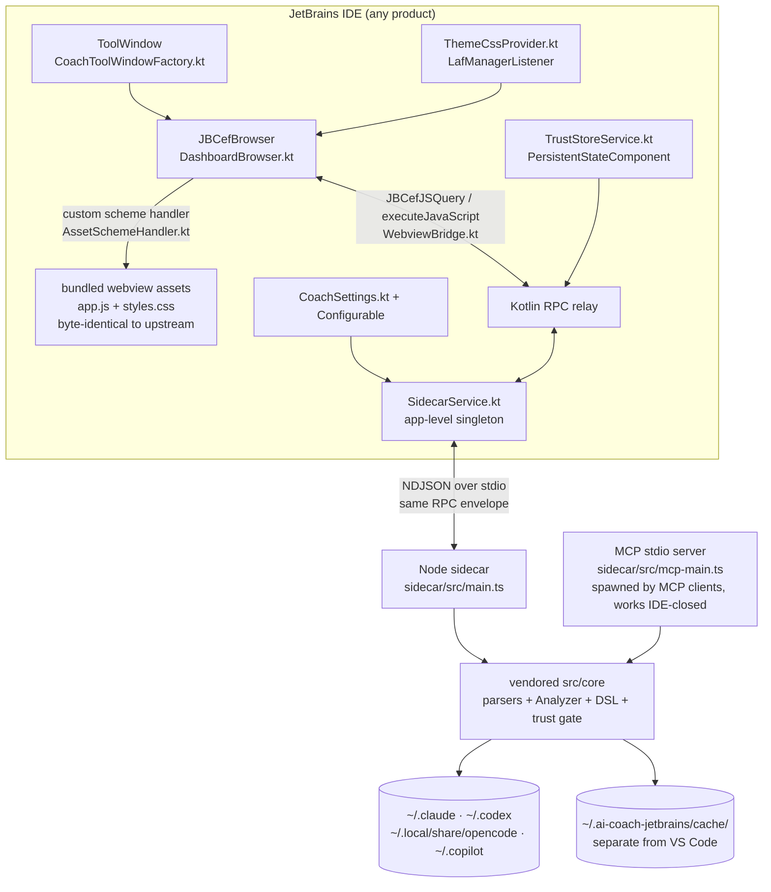

> **Note:** This plan has been split into parts. See the `-part-N` files in this directory (part 1: scaffold+sync · 2: Node sidecar · 3: Kotlin shell · 4: theme/state · 5: trust gate · 6: MCP + host-method completion · 7: hardening/Marketplace). This document remains the architectural source of truth (decisions D1–D8, disposition tables, acceptance criteria).

## feat: port AI Engineer Coach to JetBrains IDEs - Extensive

## Overview

Build a JetBrains IDE plugin (new independent repo, MIT-licensed with attribution to microsoft/MS-AI-Engineering-Coach) that brings AI Engineer Coach to the entire JetBrains family (IDEA, PyCharm, WebStorm, GoLand, Rider, …). The plugin reuses ~90% of the existing codebase: the ~36k LOC `src/core` (parsers, analyzers, rules/metrics DSL, trust gate, cache) runs unmodified in a Node.js sidecar process, and the ~18k LOC Preact dashboard bundle renders unmodified inside a JCEF browser in an IDE tool window. A thin Kotlin shell (~2–4k LOC) provides the tool-window host, the JS↔Kotlin↔sidecar RPC relay, Node detection, theme integration, the trust-approval UI, and settings. The VS Code chat participant is replaced by a standalone stdio MCP server exposing the same 12 `aiEngineerCoach_*` analytics tools. Strictly read-only and local: never modifies session files, never phones home.

## Problem Statement

AI Engineer Coach only exists as a VS Code extension, yet most of its value — parsing CLI-harness session logs (Claude Code, Codex CLI, OpenCode, Copilot CLI) and computing analytics — is IDE-independent. JetBrains users have no equivalent tool. The existing codebase is structured for portability but the VS Code host glue (~1,250 LOC), the webview embedding, the trust-approval UX, and the LLM-dependent features are all VS Code-specific and need JetBrains-native replacements.

Verified portability facts (local research):

- `src/core/` has **zero `vscode` imports** and already runs in plain Node child processes (`src/core/parse-worker.ts`, `src/core/warm-up-worker.ts`, `src/core/cache-write-worker.ts`).
- The webview talks to the host exclusively through a typed JSON RPC envelope — 75 methods (55 core in `RpcMethodMap`, 20 extension-specific in `ExtensionMethodMap`, `src/core/types/rpc-types.ts:57-139`), request `{type:'request', id, method, params}` / response `{type:'response', id, data}` plus host-pushed `{type:'progress', …}` and `{type:'dataReady'}` (`src/webview/panel.ts:147,244`).
- The webview's only host touchpoint is the `acquireVsCodeApi()` singleton (`src/webview/shared.ts:8-9`) exposing `postMessage`/`getState`/`setState`. The Playwright harness (`tests/e2e/harness.html:78-93`) already proves the bundle runs in any browser by defining a global `acquireVsCodeApi` mock — the same trick lets JCEF host the **byte-identical upstream bundle** with zero patches.
- Theme is pure CSS: exactly **21 `--vscode-*` variables** (enumerated in `tests/e2e/harness.html`), all with fallbacks in `src/webview/styles.css:8-37`. No runtime theme listeners in the webview.
- The trust gate depends only on a 2-method `TrustMemento` interface (`src/core/rule-trust.ts:31-34`).

## Proposed Solution



### Settled architecture decisions

| # | Decision | Choice | Rationale |
|---|----------|--------|-----------|
| D1 | Cache | **Separate dir** `~/.ai-coach-jetbrains/cache/` (revises the brainstorm's shared-cache decision) | Upstream cache writes are non-atomic two-file fire-and-forget with no locking (`src/core/cache.ts`); `CACHE_VERSION` drift between fork and upstream would cause a mutual eviction loop (full re-parse on every IDE switch); the fork's save would overwrite the shared cache with fewer session sources, making VS Code's workspaceStorage sessions "disappear". Costs one duplicate parse for dual-IDE users — acceptable. Fork additionally writes via temp-file + rename. |
| D2 | MCP transport | **stdio standalone entry point** (`sidecar/src/mcp-main.ts`) | The MCP client spawns the server itself, so analytics tools work with the IDE closed (reads cache; parses itself on cache miss). No ports, no auth surface, no multi-window port conflicts. Plugin provides a "Set up MCP" copy-paste config UI. |
| D3 | Upstream code sharing | **Vendored snapshot + sync script** (`tools/sync-upstream.mjs`) | Script records the upstream SHA, copies `src/core` + `src/webview` + rules/metrics md files, applies a small, auditable patch set, and runs the vendored test suite. Drift is explicit; no publishing infrastructure needed. |
| D4 | Sidecar topology | **One application-level sidecar singleton** shared by all IDE windows | The parsed dataset is global (user-level log dirs), not per-project; per-project sidecars would multiply memory by open-window count for identical data. Project-scoped state is limited to the project rule layer and per-window webview UI state. |
| D5 | Trust store | **Kotlin-side** `PersistentStateComponent` exposed to the sidecar through a `TrustMemento`-shaped RPC adapter | Matches upstream's host-`globalState` design; keeps approval authority in the IDE host, not in a user-writable file sitting next to the untrusted rules. Approvals are intentionally per-host-app (a rule approved in VS Code is pending again in IntelliJ) — documented behavior. |
| D6 | LLM-feature degradation | **`getCapabilities` RPC** (`{llm: false, host: 'jetbrains'}`) answered by the Kotlin relay; webview gates LLM entry points on it | Forking the webview bundle per host would destroy the reuse premise. The capability method is designed to be upstreamable (VS Code host answers `{llm: true}`); until upstream adopts it, it lives in the fork's webview patch set (the one allowed divergence). Note: `getCapabilities` is a plan-introduced method — it does not exist in upstream `rpc-types.ts` and is answered locally by the bridge. |
| D7 | Webview embedding | **Custom scheme handler** (`https://aicoach/index.html` via `CefSchemeHandlerFactory`), not `loadHTML` | `loadHTML` proxies through `file://` and breaks relative `<script src>` resolution; a scheme handler serves bundled resources from the plugin JAR and gives a real origin (needed for `localStorage`, Trusted Types). |
| D8 | v1 log sources | **CLI harnesses only**: Claude Code, Codex CLI, OpenCode, Copilot CLI (`~/.copilot/session-state`). JetBrains-native parsers (Copilot for JetBrains, AI Assistant, Junie) deferred to post-v1 spikes | External research verdict: Copilot for JetBrains stores sessions in a binary Nitrite/H2-MVStore DB (`copilot-agent-sessions-nitrite.db`, undocumented, has broken across plugin versions); AI Assistant uses undocumented workspace XML (`ChatSessionStateTemp`, lost on IDE major upgrades); Junie's session format has no confirmed public source. None are safely shippable without hands-on spikes. The VS Code workspaceStorage and Xcode parsers are dropped from the discovery path (code stays vendored, just not wired into `findLogsDirs`). |

## Technical Approach

### Architecture

#### New repository layout

```
ai-coach-jetbrains/                  # working name — final branding is a pre-release task
├── plugin/                          # Kotlin, IntelliJ Platform Gradle Plugin 2.x
│   ├── build.gradle.kts             # sinceBuild=242+, depends only on com.intellij.modules.platform
│   └── src/main/
│       ├── kotlin/…/
│       │   ├── CoachToolWindowFactory.kt        # ToolWindowFactory + DumbAware
│       │   ├── jcef/DashboardBrowser.kt         # JBCefBrowser lifecycle, JBCefApp.isSupported() gate
│       │   ├── jcef/AssetSchemeHandler.kt       # serves /webview/* resources from the JAR
│       │   ├── jcef/WebviewBridge.kt            # JBCefJSQuery ↔ sidecar relay, message queue-until-ready
│       │   ├── sidecar/SidecarService.kt        # @Service(APP) singleton, lifecycle + supervisor
│       │   ├── sidecar/SidecarProcess.kt        # GeneralCommandLine + KillableProcessHandler, NDJSON framing
│       │   ├── sidecar/NodeDetector.kt          # detection cascade (settings → PATH → well-known locations)
│       │   ├── theme/ThemeCssProvider.kt        # 21-variable mapping + LafManagerListener
│       │   ├── trust/TrustStoreService.kt       # PersistentStateComponent<ApprovalMap>
│       │   ├── trust/TrustApprovalDialog.kt     # list pending, view source, approve/reject
│       │   ├── settings/CoachSettings.kt        # node path, log-dir overrides, cache-clear
│       │   ├── settings/CoachSettingsConfigurable.kt
│       │   └── export/ExportSummaryHandler.kt   # FileChooser + sidecar content round-trip
│       └── resources/
│           ├── META-INF/plugin.xml
│           └── webview/                          # upstream dist/webview/* + index.html + bootstrap.js
├── sidecar/                          # TypeScript, esbuild → single CJS bundles
│   ├── src/main.ts                   # IDE-facing entry: NDJSON RPC server over stdio
│   ├── src/rpc-server.ts             # envelope framing, request dispatch, progress forwarding
│   ├── src/rpc-handlers.ts           # 55 core methods → Analyzer calls (vendor or re-derive from panel-rpc.ts, see Phase 1)
│   ├── src/host-shims.ts             # capabilities, trust-memento-over-RPC, export content, state store
│   ├── src/cache-paths.ts            # overrides CACHE_DIR → ~/.ai-coach-jetbrains/cache/, atomic writes
│   ├── src/mcp-main.ts               # standalone MCP stdio entry (12 tools, @modelcontextprotocol/sdk)
│   └── vendor/                       # synced from upstream — never hand-edited
│       ├── core/                     #   src/core/** (incl. rules/*.md, metrics/*.metric.md, tests)
│       └── webview/                  #   src/webview/** (bundle built from here)
├── tools/sync-upstream.mjs           # clone/fetch upstream @ pinned SHA, copy, apply patches/, run vendored tests
├── tools/patches/                    # the complete, reviewed divergence set (target: < 10 small patches)
└── docs/ADR/                         # D1–D8 recorded as ADRs
```

#### RPC relay design (the heart of the port)

One envelope, three hops, no translation:

1. **Webview → Kotlin**: `plugin/src/main/resources/webview/bootstrap.js` defines `window.acquireVsCodeApi` *before* `app.js` loads (exactly like `tests/e2e/harness.html:78-93`), returning `{postMessage, getState, setState}`. `postMessage` forwards the JSON envelope through a `JBCefJSQuery`-injected function. This keeps the vendored webview bundle **byte-identical** to upstream output.
2. **Kotlin relay** (`WebviewBridge.kt`): forwards request envelopes to the sidecar's stdin (NDJSON), **stamping each forwarded envelope with the owning window's project ID** so the sidecar resolves the project rule layer per request (no mutable global scope — see trust gate section). Intercepts host-owned methods locally instead of forwarding: `openExternal` → `BrowserUtil.browse`, `saveModelBudgets`/`loadModelBudgets` → `PropertiesComponent`, `exportSummary` → save-flow handler, `reviewLocalRules` → `TrustApprovalDialog.kt`, `getCapabilities` → static answer. Queues messages until the sidecar handshake completes; rejects with a typed error after a 10s connect timeout.
3. **Sidecar** (`rpc-server.ts`): dispatches the 55 core methods to `Analyzer`; emits `progress`/`dataReady` push messages on stdout, which Kotlin relays into the page via `executeJavaScript` dispatching a `MessageEvent` (the shape `window.addEventListener('message')` in `src/webview/shared.ts:53-87` already expects).
   - JBCefJSQuery handlers run on a CEF I/O thread — never touch Swing there; hop to EDT/coroutines.
   - Large responses flow Kotlin→JS via `executeJavaScript` (no practical size limit); JS→Kotlin payloads (requests) are small by construction.
4. **`getState`/`setState` shim**: `getState()` is called synchronously at webview startup, and JCEF has no synchronous JS→Kotlin call — so the restore path is serve-time inlining: `AssetSchemeHandler.kt` reads `PropertiesComponent` synchronously at request time and inlines the serialized state into the served `bootstrap.js` as `window.__INITIAL_STATE__ = {...}`. `getState()` returns the pre-seeded value; `setState()` updates the in-page cache and posts an async `persistState` host method (keys: `aicoach.webviewState.<page>`). Dashboard page/filter state survives tool-window hide/show — parity with VS Code.

#### RPC method disposition table (all 20 extension methods + the 3 LLM-dependent core methods — none may be left unmapped)

The degrade rows mix extension methods and **core** `RpcMethodMap` methods: `generateRule`, `compileNlRule`, and `explainOccurrence` are core methods the sidecar will receive but must answer with the typed `llm-unavailable` error (`explainOccurrence` is in `LLM_METHODS` at `src/webview/shared.ts:15` and builds `vscode.LanguageModelChatMessage` at `panel-rpc.ts:970`). `importRegistryRules` is core and non-LLM — it ports.

| Method | Disposition | Where |
|--------|------------|-------|
| `openExternal` | Shim → `BrowserUtil.browse` | `WebviewBridge.kt` |
| `saveModelBudgets` / `loadModelBudgets` | Shim → `PropertiesComponent` (app-level) | `WebviewBridge.kt` |
| `exportSummary` | Port → IntelliJ save flow | `ExportSummaryHandler.kt` (Phase 6) |
| `getWorkspaceDeps`, `getSdlcToolAnalysis`, `getSdlcRepoScan` | Port → sidecar (filesystem reads, no vscode dependency — verify during Phase 1 audit) | `rpc-handlers.ts` |
| `getSdlcGitHubData` | Audit: if it needs VS Code auth/session APIs → degrade (`llm`-style capability flag `github:false`); else port | Phase 1 audit |
| `reviewContextFiles` | Port if filesystem-only; audit in Phase 1 | `rpc-handlers.ts` |
| `installSkill`, `installCatalogItem`, `discoverCatalog`, `importRegistryRules` | Port if filesystem/network-only; audit in Phase 1 | `rpc-handlers.ts` |
| `triageSkills`, `triageCatalog` | Audit: LLM-dependent? If yes → degrade | Phase 1 audit |
| `generateRule`, `compileNlRule`, `explainOccurrence`, `generateLearningQuiz`, `generateLearningResources`, `generateCodeComparison`, `generateDidYouKnow`, `createSkill`, `generateSkillContent` | **Degrade**: typed `{error:'llm-unavailable'}` response + UI gated on `getCapabilities().llm === false`, with messaging pointing to the MCP tools in Claude Code | `host-shims.ts` + webview patch (D6) |
| `reviewLocalRules` (core method) | **Shim** → opens `TrustApprovalDialog.kt` (upstream fires a VS Code command, `panel-rpc.ts:893` — must be intercepted by the bridge, never forwarded to the sidecar) | `WebviewBridge.kt` |

Per-page consequence (Phase 6 produces the final audited table): Rules editor loses NL→rule and generate (manual DSL editing keeps working); Learning page loses quiz/resources/did-you-know (decide hide-page vs. static remainder after audit); Skills page keeps install/triage (if non-LLM) and loses generation.

#### Theme mapping (23 variables — initial mapping, finalized in Phase 3)

The 21 variables below come from the CSS layer (`tests/e2e/harness.html`); two more are read from computed style at Chart.js mount (`src/webview/shared.ts:107-108`) and must also be injected: `--vscode-panel-border` (→ `UIManager "Component.borderColor"`) and `--vscode-font-family` (→ the IDE's UI font family string).

`ThemeCssProvider.kt` derives values via `UIManager`/`JBColor`/`EditorColorsManager`, injects them as `:root` custom properties **before first render** (inline `<style>` in the scheme-handler-served `index.html`) and re-injects live (no page reload) on `LafManagerListener.TOPIC`.

| CSS variable | IntelliJ source (starting point) |
|---|---|
| `--vscode-editor-background` | `EditorColorsManager.globalScheme.defaultBackground` |
| `--vscode-editor-foreground` | `EditorColorsManager.globalScheme.defaultForeground` |
| `--vscode-foreground` | `UIManager "Label.foreground"` |
| `--vscode-descriptionForeground` | `UIManager "Label.infoForeground"` |
| `--vscode-sideBar-background` | `UIManager "Panel.background"` |
| `--vscode-button-background` / `-foreground` | `UIManager "Button.default.startBackground"` / `"Button.default.foreground"` |
| `--vscode-badge-background` / `-foreground` | `UIManager "Counter.background"` / `"Counter.foreground"` |
| `--vscode-input-background` / `-foreground` / `-border` | `UIManager "TextField.background"` / `"TextField.foreground"` / `"Component.borderColor"` |
| `--vscode-list-hoverBackground` | `UIManager "List.hoverBackground"` |
| `--vscode-focusBorder` | `UIManager "Component.focusedBorderColor"` |
| `--vscode-textLink-foreground` | `UIManager "Link.activeForeground"` |
| `--vscode-charts-{red,green,blue,yellow,orange,purple}` | Fixed palette per light/dark (`JBColor.isBright()`), tuned for contrast on both |

JCEF browser component background is set to the theme `Panel.background` to avoid a white flash before page load. Chart.js reads colors at mount (`src/webview/shared.ts:90-110`) — theme switch with charts open is an explicit test case; if recolor fails, fall back to a dashboard soft-reload preserving state via the `getState` shim.

#### Node sidecar lifecycle

- **Detection cascade** (`NodeDetector.kt`): configured setting → `PathEnvironmentVariableUtil.findInPath("node")` → well-known locations (`~/.nvm/versions/node/*/bin`, `~/.volta/bin`, `~/.local/share/fnm`, `/opt/homebrew/bin`, `/usr/local/bin`, `%ProgramFiles%\nodejs`) → manual file picker. Validate with `node --version` (≥ 20 — Node 18 reached EOL April 2025; the brainstorm's ≥ 18 floor is raised accordingly) and a 5s hang guard — "found but too old" and "found but broken" are distinct, actionable error panels. GUI-launched IDEs on macOS don't inherit shell PATH, and the audience disproportionately uses version managers — the cascade, not bare PATH lookup, is the primary path.
- **Supervisor** (`SidecarService.kt`): app-level `@Service` with injected `CoroutineScope`; spawn off-EDT via `GeneralCommandLine` + `KillableProcessHandler`. Crash → restart with backoff, max 3 attempts, then dashboard error banner with "Restart sidecar" and "View logs" actions. Sidecar logs to `~/.ai-coach-jetbrains/logs/sidecar.log` (rotated).
- **Orphan prevention**: sidecar exits when stdin closes (parent death signal); on startup the service kills any stale PID recorded in `~/.ai-coach-jetbrains/sidecar.pid`.
- **Shutdown**: `dispose()` sends a shutdown request, waits ≤2s for cache flush, then `destroyProcess()`. Cache writes use temp-file + rename so SIGKILL never tears the cache (D1).
- **Workers**: keep upstream's model unmodified inside the sidecar — `parse-worker` via `child_process.fork`, `warm-up-worker` via `worker_threads` (zero patches to `src/core/parser.ts:626-744` / `analyzer.ts:124-180`).
- **Bundle extraction**: sidecar JS is extracted from the plugin JAR to a **version-stamped** dir (`~/.ai-coach-jetbrains/runtime/<pluginVersion>/`) so plugin updates never run a stale bundle.

#### Trust gate flow

- Sidecar's rule/metric loaders receive a `TrustMemento` implementation backed by RPC calls to `TrustStoreService.kt` (`trust/get`, `trust/update` host methods) — `src/core/rule-trust.ts` ports unmodified.
- Pending rules trigger an IDE notification ("N local rules pending review") → `TrustApprovalDialog.kt`: table of file path / layer / kind, **View Source** (opens the md file in the IDE editor), Approve / Approve All / Reject. Pending rules are never executed and never appear in any page or MCP output.
- `saveRule` auto-approval parity (`src/webview/panel-rpc.ts:846-878`): rules saved from the dashboard editor are auto-trusted for the personal layer — replicated in `rpc-handlers.ts`, else every dashboard-authored rule immediately shows untrusted.
- Edit-revokes-trust: a file watcher on `~/.ai-engineer-coach/` + project rule dirs re-checks hashes and re-surfaces the pending notification.
- Project layer: scope is **per-request** — the bridge stamps every forwarded envelope with the owning window's project ID and the sidecar resolves the project rule layer per request (a focus-based mutable global would let a request from window A be evaluated under window B's rules if focus changes mid-flight). Rules from one project never execute against another's dashboard. Projects in IntelliJ "safe mode" (untrusted) get the project layer hard-blocked regardless of rule approval.
- Headless MCP path: untrusted rules stay pending silently; approval requires the IDE (documented).

#### MCP server (stdio standalone)

- `sidecar/src/mcp-main.ts` uses `@modelcontextprotocol/sdk` stdio transport; exposes the 12 tools from `src/mcp/tools.ts:70-185` with names **pinned as `aiEngineerCoach_*`** regardless of final plugin branding (renames break users' saved client configs). Formatters (`src/mcp/formatters.ts`) port unmodified; only the `vscode.lm.registerTool` registration layer is replaced.
- Data freshness contract: serve from cache if fresh (dirMetas check); on stale/missing cache, parse with a fast-progress note in the first tool response ("parsing N sessions, partial data") to stay inside MCP client timeouts.
- Setup UX for v1 is documentation, not a dialog (KISS): the README/docs page shows `claude mcp add aicoach -- node ~/.ai-coach-jetbrains/runtime/current/mcp-main.js` plus generic JSON for other clients — the **stable `runtime/current` path** means configs survive plugin updates. A one-time notification balloon ("MCP tools available — see setup docs") provides discoverability; an in-IDE setup dialog is post-v1 polish.

### Implementation Phases

#### Phase 0: Repo scaffold + upstream sync pipeline (prerequisite for all vendored code)

- [ ] Create repo from `intellij-platform-plugin-template`; Gradle Plugin 2.x; `<depends>com.intellij.modules.platform</depends>` only; CI (build, verifyPlugin, vitest on sidecar)
- [ ] `tools/sync-upstream.mjs`: pin upstream SHA, copy `src/core` + `src/webview` + rules/metrics into `sidecar/vendor/`, apply `tools/patches/`, run vendored vitest suite, fail on patch conflicts
- [ ] MIT LICENSE + NOTICE with Microsoft attribution; ADRs for D1–D8 in `docs/ADR/`
- [ ] esbuild config for sidecar bundles (main.js, mcp-main.js, parse-worker.js, warm-up-worker.js, cache-write-worker.js) mirroring upstream `esbuild.mjs` worker handling

**Success criteria**: sync script produces a green vendored test run from a clean clone; CI gates on it.
**Estimated effort**: 3–5 days.

#### Phase 1: Node sidecar (core wrapped in stdio RPC)

- [ ] `rpc-server.ts`: NDJSON framing of the existing envelope; dispatch, progress/dataReady forwarding; handshake (`hello` exchange with version + capabilities); per-request project-scope resolution from the envelope stamp
- [ ] **Re-derive the handler map into `rpc-handlers.ts`** (primary path, not fallback): `panel-rpc.ts` contains 5 inline `require('vscode')` calls (lines ~70, 787, 892, 947, 1043), so it cannot be vendored as-is. The 52 non-LLM core methods are mostly 1:1 Analyzer getter calls (`src/core/analyzer.ts:182-254`); the 3 LLM core methods (`generateRule`, `compileNlRule`, `explainOccurrence`) return the typed `llm-unavailable` error. `getWorkspaceDeps` and `saveRule`'s workspace-root lookups are replaced by the per-request project scope — no VS Code call survives into the sidecar
- [ ] Audit the 9 "audit" rows of the disposition table (`getSdlcGitHubData`, `triageSkills`, `triageCatalog`, `installSkill`, `installCatalogItem`, `discoverCatalog`, `reviewContextFiles`, `getWorkspaceDeps`, SDLC methods) — finalize port vs. degrade for each
- [ ] `cache-paths.ts`: cache dir → `~/.ai-coach-jetbrains/cache/`, temp-file + rename writes, corrupted-cache → log + re-parse (never crash)
- [ ] Disable VS Code workspaceStorage + Xcode discovery in `findLogsDirs` (patch in `tools/patches/`); keep Claude/Codex/OpenCode/Copilot-CLI collectors as-is; keep `FF_TOKEN_REPORTING_ENABLED` at upstream's default (documented flag disposition)
- [ ] Committed fixture dataset (~500 synthetic sessions / ~50 MB) for perf and integration tests
- [ ] Trust-memento-over-RPC adapter + `saveRule` auto-approval in `host-shims.ts`
- [ ] Stdio integration tests, one per method, generated mechanically from the typed `RpcMethodMap` (drive the sidecar from a test script, no IDE needed): every ported method returns a shape-valid response; every degraded method returns the typed error; progress + dataReady verified on a parse run

**Success criteria**: sidecar parses real local logs from the command line; the per-method stdio test suite passes (52 ported core methods answer, 3 LLM core methods degrade); vendored core tests still green.
**Estimated effort**: 1.5–2 weeks.

#### Phase 2: Kotlin shell — tool window, JCEF, bridge, Node detection

- [ ] `CoachToolWindowFactory.kt` (DumbAware, lazy); `JBCefApp.isSupported()` gate → Swing fallback panel (explanation + `ide.browser.jcef.enabled` registry guidance) within 2s
- [ ] `AssetSchemeHandler.kt` serving `plugin/src/main/resources/webview/*`; `index.html` + `bootstrap.js` (the `acquireVsCodeApi` shim, pre-injected theme CSS, serve-time-inlined `window.__INITIAL_STATE__`); **serves a CSP equivalent to upstream `panel-html.ts:10-66`** (script-src restricted to the scheme, no remote origins — a custom scheme has no CSP unless we serve one, and the webview renders data derived from untrusted session logs)
- [ ] Trusted Types spike: verify the bundle's Trusted Types policy works under the bundled JCEF Chromium; the fallback (disabling policy enforcement via patch) is permitted only with the CSP above verified present
- [ ] `WebviewBridge.kt`: JBCefJSQuery wiring (queries **created before browser initialization** — platform constraint; handlers run off-EDT), queue-until-handshake, 10s connect timeout → error state, host-method interception (`openExternal`, budgets, `reviewLocalRules`, capabilities), per-request project-ID stamping, broadcast of progress/dataReady to **all** open tool windows
- [ ] `NodeDetector.kt` cascade + "Node missing/too old/broken" panels with Retry (no IDE restart) and settings shortcut
- [ ] `SidecarService.kt` + `SidecarProcess.kt`: supervisor, backoff restart, orphan kill, version-stamped runtime extraction with a **stable `runtime/current` entry point** (atomically updated launcher/symlink, so external references like MCP configs survive plugin updates), shutdown flush
- [ ] `CoachSettings.kt` / Configurable: Node path override, log-dir overrides, "Clear analytics cache" action
- [ ] Tests land with the code: `SidecarService` lifecycle tests (spawn / crash-restart / dispose / orphan sweep) via LightPlatformTestCase or equivalent; Playwright harness (second static harness mirroring the `bootstrap.js` shim, same pattern as upstream `tests/e2e/harness.html`) validating the served bundle against a mock bridge

**Success criteria**: dashboard renders real data in IDEA and at least one non-IDEA IDE (PyCharm or GoLand); first-run failure states (no Node / no JCEF / no logs / parse-in-progress) all show designed panels, not blanks.
**Estimated effort**: 2–3 weeks.

#### Phase 3: Theme integration + webview state persistence

- [ ] `ThemeCssProvider.kt`: full 21-variable mapping table (above), pre-first-render injection, JCEF component background
- [ ] `LafManagerListener` live re-injection without page reload; Chart.js recolor test (burndown page open during switch); fallback soft-reload preserving state if recolor is impossible
- [ ] `getState`/`setState` shim → `PropertiesComponent` round-trip; verify page/filter state survives hide/show and IDE restart
- [ ] Light, dark, high-contrast, and one third-party theme (Material) visual pass across every nav-registry page

**Success criteria**: no white flash on open; theme switch updates the live dashboard including charts; navigation state survives tool-window hide/show.
**Estimated effort**: 1 week.

#### Phase 4: Trust gate UI + project rule scoping

- [ ] `TrustStoreService.kt` (`PersistentStateComponent<ApprovalMap>`, `RoamingType.DISABLED`)
- [ ] `TrustApprovalDialog.kt` + pending notification; View Source opens file in editor; Approve/Approve All/Reject; **Approve records the hash of the source as displayed in the dialog**, not a re-read at approve time (TOCTOU: an edit between View Source and Approve must not get silently trusted)
- [ ] Wire the `reviewLocalRules` bridge interception to the dialog
- [ ] File watcher → edit-revokes-trust re-prompt
- [ ] Project-scope plumbing (per-request stamping end-to-end, safe-mode hard block)
- [ ] Tests land with the code: `TrustStoreService` tests (approve / revoke-on-edit / pending-never-executes / TOCTOU hash)

**Success criteria**: a pending rule's detections never appear anywhere; modifying an approved rule excludes it from the next run and re-lists it pending; cross-project rule leakage test passes with two projects open.
**Estimated effort**: 1 week.

#### Phase 5: MCP stdio server + setup UX

- [ ] `mcp-main.ts`: 12 tools via `@modelcontextprotocol/sdk`, names pinned `aiEngineerCoach_*`; cache-first freshness contract; trust gate honored on the headless path
- [ ] Setup docs (README/docs page) with stable-path config snippets (Claude Code command + generic JSON) + one-time discovery notification balloon (in-IDE setup dialog deferred to post-v1)
- [ ] IDE-closed end-to-end test: `claude mcp add` → tool call → correct analytics with no IDE running

**Success criteria**: all 12 tools callable from Claude Code with and without the IDE open; untrusted-rule exclusion verified on the headless path.
**Estimated effort**: 1 week.

#### Phase 6: Host-method completion — export, LLM degradation, link-out audit

- [ ] `ExportSummaryHandler.kt`: webview → bridge → sidecar content → IntelliJ directory chooser (multi-file export), date-stamped defaults, preserves dashboard date-filter context, success notification with "Show in Files", error balloons; disabled-with-tooltip during parse
- [ ] LLM degradation pass: typed `{error:'llm-unavailable'}` for the 8 generate methods; webview capability gating (the single allowed webview patch); per-page audit — decide hide vs. disable for Learning page sections and Rules-editor NL features; messaging points to MCP tools
- [ ] Unknown-method safety net: bridge answers any unmapped method with a typed error (no hung spinners — webview timeout is 120s, `src/webview/shared.ts:23-37`)
- [ ] Link-out audit: every dashboard action that opened something in VS Code maps to an IntelliJ idiom (`OpenFileDescriptor` for rule files) or is gated

**Success criteria**: full RPC-method disposition table implemented and verified — zero hung spinners across every nav-registry page exercised with LLM disabled.
**Estimated effort**: 1–1.5 weeks.

#### Phase 7: Hardening, packaging, Marketplace

- [ ] Multi-window tests: two projects, mixed IDEs (IDEA + WebStorm = two app-level sidecars, separate plugin instances), broadcast correctness, no port usage to conflict
- [ ] Lifecycle tests: IDE kill (orphan check), crash mid-parse (cache-resume), plugin update (runtime re-extraction + **MCP config still works via `runtime/current`**), uninstall (leaves user cache, kills processes)
- [ ] Cross-product run of the Playwright harness and platform-test suites built in Phases 1–4 (the harnesses themselves land with their code, not here)
- [ ] First-run data-access disclosure (reads `~/.claude` etc. — read-only/local statement, directory exclusion setting)
- [ ] Plugin signing, `verifyPlugin` across product matrix, Marketplace listing; final naming/branding decision (distinct from upstream's name or with permission)
- [ ] README, MCP setup docs, rules-authoring doc (pointing at upstream `docs/AUTHORING_RULES.md` semantics), troubleshooting ("Collect troubleshooting info" action)

**Success criteria**: `verifyPlugin` green for IDEA/PyCharm/WebStorm/GoLand/Rider current releases; signed artifact under Marketplace limits; all acceptance criteria below pass.
**Estimated effort**: 1.5–2 weeks.

#### Post-v1 (explicitly out of scope, spike-gated)

- **Spike A — JetBrains AI Assistant parser** (first: text XML, ~1–2 days on a live install; `ChatSessionStateTemp` in `<config>/workspace/<hash>.xml`)
- **Spike B — Copilot for JetBrains parser** (Nitrite/H2 MVStore; prior art: nineninesevenfour gist; complicated by the June 2026 unified-sessions change)
- **Spike C — Junie** (`~/.junie/`, format unconfirmed)
- BYO-API-key LLM features; remote development (Gateway) support — **declared unsupported in v1**; external-browser dashboard fallback for JCEF-less environments

## Alternative Approaches Considered

- **JCEF UI + Kotlin core rewrite**: no Node dependency, but rewriting ~36k LOC of parsers/analyzers/DSL delays parity by months and the parsers permanently drift from upstream log-format fixes. Rejected.
- **Full native Kotlin (Swing/Compose UI + Kotlin core)**: most idiomatic, ~50k+ LOC rewrite for a UI already proven in an embedded browser. Rejected — effort without proportional benefit.
- **Shared cache with VS Code** (the brainstorm's original call): rejected after code inspection — see D1.
- **HTTP/SSE MCP in the sidecar**: rejected — see D2 (IDE-closed story, port management).
- **git subtree / npm packages for code sharing**: rejected in favor of vendored snapshot + sync script — see D3.
- Accepted trade-off: plugin requires Node ≥ 20 (detection cascade + graceful guidance); for a developer-tool audience this buys ~90% code reuse and lockstep upstream parser fixes. Bundling Node binaries (~60–80 MB compressed, under the 400 MB Marketplace cap) is a documented future option if the requirement proves too much friction.

## Acceptance Criteria

### Functional Requirements

- [ ] Dashboard renders every page in the nav registry (under the fork's feature-flag configuration — `FF_TOKEN_REPORTING_ENABLED` stays at upstream's default, keeping burndown/token pages gated) with real local data in IDEA **and** at least two non-IDEA JetBrains IDEs
- [ ] All 45 built-in rules + 10 metrics execute; personal/project DSL layers load behind the trust gate
- [ ] First-run failure states are designed screens, not blanks: Node missing (install link + Retry that works without IDE restart + settings shortcut), Node too old (shows detected vs. required version), JCEF unsupported (explanation within 2s), no logs (lists directories checked per harness), parse in progress (live counts)
- [ ] Configured Node path wins over PATH (e.g. Node 16 on PATH, Node 20 configured → 20 used)
- [ ] A pending (unapproved) rule is never executed; its detections appear in no page and no MCP tool output
- [ ] Approval dialog shows full rule source at most one click from the Approve action; editing an approved rule on disk excludes it from the next run and re-lists it pending
- [ ] Rules saved from the dashboard editor are auto-trusted (personal layer) — parity with `panel-rpc.ts:846-878`
- [ ] All 12 MCP tools callable from Claude Code with the IDE closed; setup dialog provides working copy-paste config
- [ ] Export summary writes date-stamped files via an IntelliJ chooser, preserves the dashboard's date filter, and reports success/failure visibly
- [ ] Theme switch (light↔dark) updates the open dashboard live — including charts — without losing page/filter state
- [ ] Dashboard page/filter state survives tool-window hide/show
- [ ] Every one of the 20 extension RPC methods has an implemented disposition (port/shim/degrade) — exercising all pages with LLM disabled produces zero hung spinners
- [ ] Two IDE windows (and two different JetBrains products) run concurrently without errors, port conflicts, or stale dashboards

### Non-Functional Requirements

- [ ] Warm start (valid cache) to interactive dashboard ≤ 5s against a committed fixture dataset (defined in Phase 1, e.g. ~500 sessions / ~50 MB of logs — CI-testable, not vibes); cold parse shows progress within 2s of tool-window open
- [ ] Sidecar crash → automatic restart (≤3 attempts, backoff) with a "Reconnecting…" banner; hung sidecar detected via per-method-class RPC timeouts
- [ ] IDE kill never leaves an orphaned Node process (parent-death watch + startup stale-PID sweep)
- [ ] Corrupted/truncated cache never crashes the sidecar — logs and re-parses; cache writes are atomic (temp + rename)
- [ ] Strictly read-only on session logs; no network calls except user-initiated `openExternal`; first-run disclosure of directories read + exclusion setting
- [ ] Plugin depends only on `com.intellij.modules.platform`; signed; passes `verifyPlugin` for the supported product matrix

### Quality Gates

- [ ] Vendored core test suite green after every upstream sync (CI-gated)
- [ ] Sidecar RPC layer covered by stdio-driven integration tests (no IDE required)
- [ ] JCEF bridge covered by a Playwright harness against the served bundle with a mocked bridge
- [ ] Kotlin: lifecycle/disposal paths covered (LightPlatformTestCase or equivalent) for SidecarService, TrustStoreService
- [ ] `tools/patches/` reviewed: every divergence from upstream documented with a reason; target < 10 patches
- [ ] ADRs for D1–D8 merged; README/setup/troubleshooting docs complete

## Success Metrics

- Upstream sync cost: pulling a new upstream SHA takes < 1 hour including test verification (measures D3's health)
- Patch-set size stays < 10 files (measures reuse integrity)
- First-run completion rate: Node detection cascade succeeds without manual path entry for nvm/volta/Homebrew/system installs in team dogfooding
- Marketplace review: no rejections for process leaks, EDT violations, or undeclared data access

## Dependencies & Prerequisites

- Upstream microsoft/MS-AI-Engineering-Coach at a pinned SHA (sync target)
- IntelliJ Platform Gradle Plugin 2.x; JetBrains Runtime with JCEF (platform builds ≥ 2020.2; pick `sinceBuild` ≥ 242)
- `@modelcontextprotocol/sdk` for the MCP entry point
- User machine: Node ≥ 20 discoverable (cascade) or configured
- JetBrains Marketplace vendor account + signing certificate (Phase 7)
- Branding decision (new name or upstream permission) — blocks Marketplace listing only, not development

## Risk Analysis & Mitigation

| Risk | Likelihood | Impact | Mitigation |
|------|-----------|--------|------------|
| Node undetectable for version-manager users (macOS GUI PATH) | High | First-run failure | Detection cascade beyond PATH (nvm/volta/fnm/Homebrew dirs) + manual picker + Retry without restart; dogfood across setups |
| Trusted Types unsupported/misbehaving in the bundled JCEF Chromium | Medium | Webview bootstrap failure | Phase 2 spike task: verify the bundle's Trusted Types policy under JCEF; fallback patch disabling policy enforcement under the custom scheme (CSP still applies) |
| Chart recolor on live theme switch doesn't take | Medium | Half-themed dashboard | Tested fallback: soft reload preserving state via the getState shim |
| Upstream restructures `src/core`/`src/webview` | Medium | Sync script breaks | Pinned-SHA syncs are deliberate; patches conflict loudly in CI; ADR documents re-vendoring procedure |
| `panel-rpc.ts` handler bodies import vscode more deeply than expected | Medium | Phase 1 grows | Audit is the first Phase 1 task; fallback is re-deriving the 55-method map from Analyzer getters (mechanical) |
| Orphan Node processes / EDT violations flagged by Marketplace review | Medium | Listing rejection | Explicit lifecycle phase (7) with kill/orphan tests; coroutine-based process handling per platform threading rules |
| JCEF unsupported environments (Gateway, some Linux) | Low–Med | No dashboard | Designed fallback panel; remote dev declared unsupported in v1; MCP tools still work |
| MCP client timeout on cold parse | Medium | Bad first MCP experience | Cache-first contract + partial-data first response |
| DSL drift: a rule written against the fork's engine fails in upstream's (shared `~/.ai-engineer-coach/`) | Low (vendoring keeps engines close) | Confusing rule errors | Surface rule parse errors in the dashboard (verify upstream UX ports); sync cadence keeps engines aligned |

## Resource Requirements

- 1 developer with Kotlin/IntelliJ-plugin and TypeScript/Node experience (or one of each pairing)
- Total estimated effort: **9–12 weeks** across Phases 0–7
- Test machines or VMs covering macOS/Linux/Windows and ≥ 3 JetBrains products; JetBrains Marketplace account

## Future Considerations

- Upstreaming `getCapabilities` to microsoft/MS-AI-Engineering-Coach would shrink the webview patch set to ~zero
- JetBrains-native parsers (Spikes A–C) extend the moat: AI Assistant XML first, Copilot Nitrite second
- BYO-API-key LLM generation features (rule generation, quiz) behind a settings-provided key
- Bundled per-platform Node runtimes if the Node prerequisite proves to be the top funnel drop-off
- HTTP MCP transport as an additive option for always-fresh in-IDE data

## Documentation Plan

- New repo: README (what/setup/run/contributing), `docs/ADR/0001-cache-isolation.md` … `0008-v1-log-sources.md`, MCP setup guide, troubleshooting guide, `tools/patches/README.md` (divergence log), NOTICE/attribution
- This repo (upstream): nothing changes in v1; if `getCapabilities` is upstreamed later, `docs/AUTHORING_RULES.md`-style docs gain a host-capabilities note

## References & Research

### Internal References

- Brainstorm: `docs/brainstorm/2026-06-11-intellij-plugin-port-brainstorm-doc.md`
- RPC contract: `src/core/types/rpc-types.ts:57-148` (75 methods, envelope shapes)
- Webview host glue: `src/webview/panel.ts:43-91,147,182-188,244` · `src/webview/panel-rpc.ts:846-878,1321-1325` · `src/webview/panel-html.ts:10-66`
- Webview client singleton: `src/webview/shared.ts:8-9,23-37,53-87,90-110`
- Browser-host proof + CSS variable list: `tests/e2e/harness.html:78-93` (21 `--vscode-*` vars)
- Workers: `src/core/parse-worker.ts` · `src/core/warm-up-worker.ts` · `src/core/cache-write-worker.ts` · spawn sites `src/core/parser.ts:626-744`, `src/core/analyzer.ts:124-180`
- Cache: `src/core/cache.ts:91,95` (`CACHE_DIR`, `CACHE_VERSION = 9`), non-atomic write path
- Trust gate: `src/core/rule-trust.ts:31-34,44,56-78,92-149` · loaders `src/core/rule-loader.ts:45-164,216-294`
- MCP tools: `src/mcp/tools.ts:70-207` (12 tools) · `src/mcp/formatters.ts` · chat participant `src/chat/participant.ts`
- Log discovery: `src/core/parser-harnesses.ts:35-72` · `src/core/parser-vscode.ts:21-65` · `src/core/parser-xcode.ts:23-29`
- Build: `esbuild.mjs:1-181` · feature flags `src/core/constants.ts:127`

### External References

- JCEF: https://plugins.jetbrains.com/docs/intellij/embedded-browser-jcef.html
- Tool windows: https://plugins.jetbrains.com/docs/intellij/tool-windows.html
- Persistence: https://plugins.jetbrains.com/docs/intellij/persisting-state-of-components.html
- Theme colors: https://plugins.jetbrains.com/docs/intellij/platform-theme-colors.html
- Threading model: https://plugins.jetbrains.com/docs/intellij/threading-model.html · coroutines: https://plugins.jetbrains.com/docs/intellij/coroutine-scopes.html
- Process execution: https://plugins.jetbrains.com/docs/intellij/execution.html
- Gradle plugin 2.x: https://plugins.jetbrains.com/docs/intellij/tools-intellij-platform-gradle-plugin.html
- Multi-product targeting: https://plugins.jetbrains.com/docs/intellij/dev-alternate-products.html
- Signing: https://plugins.jetbrains.com/docs/intellij/plugin-signing.html · dynamic plugins: https://plugins.jetbrains.com/docs/intellij/dynamic-plugins.html
- Template: https://github.com/JetBrains/intellij-platform-plugin-template
- MCP SDK: https://github.com/modelcontextprotocol/typescript-sdk

### Related Work

- Copilot-for-JetBrains Nitrite reader (prior art for Spike B): https://gist.github.com/nineninesevenfour/9e63ea6cbbf4c307814614ebd8e442e8
- agentsview issue documenting the Nitrite blocker: https://github.com/kenn-io/agentsview/issues/104
- GitHub Copilot plugin's bundled-Node fallback pattern (precedent for future Node bundling)
