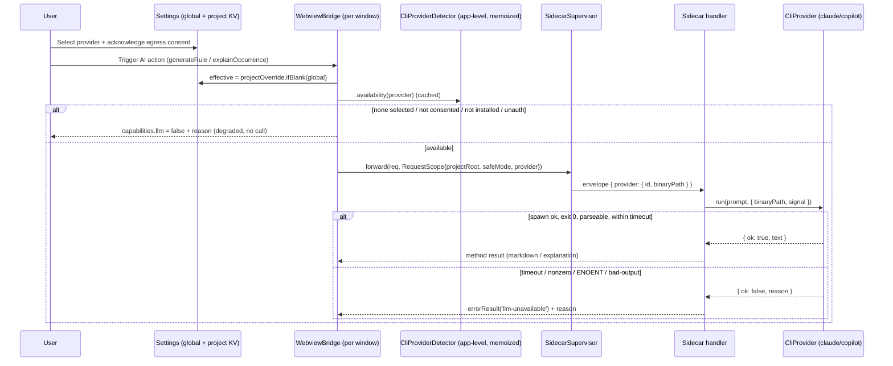
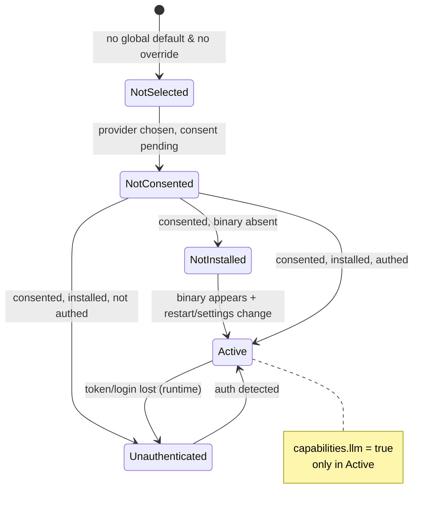

## feat: selectable CLI provider for AI-backed features - Extensive

## Overview

Wire two currently-stubbed AI features — `generateRule` and `explainOccurrence` —
to a real inference backend by letting the user select which installed CLI agent
(**Claude Code** or **GitHub Copilot CLI**) powers them.

Today these handlers short-circuit to `errorResult('llm-unavailable')` because the
upstream LLM call routes through the VS Code host language model
(`vscode.LanguageModelChatMessage` + `callLlm`), which does not exist in the
JetBrains port (`sidecar/src/rpc-handlers.ts:79-96`; `sidecar/vendor/webview/panel-rpc.ts:947-994`
for `explainOccurrence`, `:1048-1090` for `generateRule`).

A `CliProvider` interface in the Node sidecar gains two implementations that shell
out (non-interactively) to the chosen CLI and normalize its output. The Kotlin host
detects installed binaries, resolves the effective per-project selection, gates on
explicit user opt-in + egress consent, and stamps the chosen provider id + binary
path onto each RPC envelope — exactly how `projectRoot`/`safeMode` are stamped today
(`SidecarSupervisor.kt:164-181`). When the selected CLI is missing, unauthenticated,
times out, or errors, the feature degrades to the existing `llm-unavailable`
behavior with a distinguishable reason surfaced in the UI. **No auto-fallback** to
the other CLI.

The plugin remains a local-only log-parsing analytics engine; this adds a distinct,
**opt-in** inference capability layered on top.

> **Scope note (post-review):** `compileNlRule` was descoped. Unlike the other two,
> its LLM call is buried in `sidecar/vendor/core/rule-compiler.ts` (private
> `compileLlm()`, with an existing non-LLM heuristic fallback), not in the handler.
> Routing it through a provider would require patching a `vendor/core/` file — a
> heavy, non-upstreamable divergence against the "minimal divergence" rule. It keeps
> its heuristic fallback and is wired in a follow-up. See Future Considerations.

## Problem Statement

The port deliberately degraded all LLM-backed methods because inference lived in the
VS Code host. JetBrains has no equivalent host LLM, so otherwise-complete features are
dead buttons in the dashboard. Users already have a CLI agent installed (the very tool
whose logs this plugin analyzes), so the cheapest, most honest backend is the CLI they
already authenticated. The challenge is doing this without:

- silently turning a local-only analytics tool into a network-egress tool (privacy);
- committing the adapter to an unstable CLI contract (Copilot has **no** stable JSON
  output and no documented exit codes — see Research);
- breaking the app-level **single shared sidecar** model (one `hello`/`capabilities`
  for N projects, each with a potentially different provider override).

## Proposed Solution

Approach **A** from the brainstorm: a `CliProvider` interface in the sidecar next to
the handlers that need it; the host owns binary detection + selection resolution and
passes the choice **per-RPC**.

Resolved product/technical decisions (`AskUserQuestion`, 2026-06-16):

1. **Opt-in, explicit only.** The feature is off until the user explicitly selects a
   provider. Never auto-enables, even if exactly one CLI is detected.
2. **Explicit consent on first enable.** Selecting a provider shows a one-time
   disclosure (prompts derived from logs will be sent to the CLI → a network LLM)
   that must be acknowledged before any prompt leaves the machine.
3. **Scope = 2 methods.** `generateRule` and `explainOccurrence` (clean `callLlm`
   swap). `compileNlRule` and the other degraded methods stay as-is.
4. **Copilot auth = env-token presence.** Treat `COPILOT_GITHUB_TOKEN` / `GH_TOKEN` /
   `GITHUB_TOKEN` presence as authenticated; real auth failures surface post-run as a
   generic `cli-error` reason (Copilot has no `auth status` subcommand).

## Technical Approach

### Architecture

**Where provider capability is computed (resolves flow-analysis Gap B).** The sidecar
is an app-level singleton (`SidecarService`, ADR 0004) whose `hello` handshake fires
once with a single `capabilities` object (`rpc-server.ts:97`). It therefore **cannot**
represent per-project provider selection. The resolved provider + its availability
status is computed **per-window, host-side**, in `WebviewBridge.capabilitiesReply()`
(`WebviewBridge.kt:211-215`) — the same seam that already synthesizes the host `github`
and `host` fields rather than passing the sidecar's flag through. The sidecar stays
provider-agnostic: it only invokes whatever provider the envelope stamp names.

**Detection is machine-global; selection is per-window (review I5).** Binary detection
(`claude --version`, env-token presence) is a property of the machine/PATH, identical
across windows — so it is owned **app-level** by `CliProviderDetector` (mirroring how
`NodeDetector` is consulted once via `SidecarService`), memoized, and invalidated on
settings change and "Restart sidecar". Only **selection resolution** (override vs
global) is per-window. The first (uncached) probe runs off the CEF/EDT thread so it
never blocks the `WebviewBridge` query callback (review N4).

**Control / data flow:**



**Provider availability state (per window):**



### Sidecar contract (Node/TS)

New module `sidecar/src/cli-provider.ts`:

```ts
export type ProviderId = 'claude' | 'copilot';

export type ProviderFailureReason =
  | 'not-installed'    // spawn ENOENT
  | 'unauthenticated'  // detected auth failure (Claude only, pre/post-flight)
  | 'timeout'          // adapter-imposed deadline hit; child killed
  | 'cli-error'        // non-zero exit / generic failure
  | 'bad-output';      // exit 0 but output unparseable, empty, or unusable

export type ProviderResult =
  | { ok: true; text: string }
  | { ok: false; reason: ProviderFailureReason };

export interface ProviderRunOptions {
  binaryPath: string;          // resolved by the host, stamped on the envelope
  signal?: AbortSignal;        // adapter-imposed timeout / shutdown cancellation
  env?: NodeJS.ProcessEnv;     // injectable for tests
  spawn?: typeof import('node:child_process').spawn; // injectable spawn seam (tests)
}

export interface CliProvider {
  readonly id: ProviderId;
  /** A single flat prompt string; role/turn structure is collapsed by the caller. */
  run(prompt: string, opts: ProviderRunOptions): Promise<ProviderResult>;
}

/** Build the provider named by the envelope stamp; narrows the untyped wire string
 *  to ProviderId, returns undefined for anything else. */
export function resolveProvider(id: string): CliProvider | undefined;
```

Notes from review:
- **Single failure surface for bad output (simplicity #3):** `parse-error` and `empty`
  collapse into one `bad-output` reason — the user cannot act differently on
  "malformed JSON" vs "blank result"; both mean "the CLI produced unusable output".
- **No `costUsd` on the contract (review N1/simplicity #7):** `total_cost_usd` has no
  consumer yet; the Claude provider may log it internally. Add to the type only when a
  dashboard widget is planned (Future Considerations).

Adapters:
- `sidecar/src/providers/claude-provider.ts` — `spawn(binaryPath, ['-p',
  '--output-format', 'json', '--tools', ''], { signal })`, prompt piped via **stdin**
  (avoids `ARG_MAX`; `claude -p` reads stdin). Parse `JSON.parse(stdout).result` (read
  only that key — secondary fields are unstable). Empty/whitespace `result` →
  `'bad-output'`; JSON parse failure → `'bad-output'`. Non-zero exit whose stderr
  matches an auth signature → `'unauthenticated'`, else `'cli-error'`. ENOENT →
  `'not-installed'`. Abort → `'timeout'`.
- `sidecar/src/providers/copilot-provider.ts` — `spawn(binaryPath, ['-p', prompt,
  '-s', '--no-ask-user'], { signal })`. **Plain-text** stdout (no JSON mode exists).
  Trim and return as `text`; empty → `'bad-output'`. **Prompt size cap** (Gap E): if
  the prompt exceeds `COPILOT_MAX_PROMPT_BYTES` (hardcoded constant, 96 KiB, headroom
  under typical `ARG_MAX`), return `{ ok:false, reason:'cli-error' }` with a logged
  note rather than an opaque spawn failure. (Copilot stdin support is undocumented —
  see Risks.)
- **Spawn safety (Gap I):** argv array only, **never** `shell: true` — no string
  interpolation of the prompt into a shell command. Adapter-imposed timeout via an
  `AbortController` (`PROVIDER_TIMEOUT_MS`, hardcoded 60 000); on abort/timeout the
  child is killed (`SIGTERM` then `SIGKILL` backstop) so nothing is orphaned (honors
  the existing orphan-prevention contract).

Wiring in `sidecar/src/rpc-handlers.ts`:

- Extend `HandlerContext` with `provider?: { id: string; binaryPath: string }`
  (stamped per-RPC, mirroring `projectRoot`/`safeMode`).
- **Remove** `generateRule` and `explainOccurrence` from `LLM_UNAVAILABLE_METHODS`
  (the set drops from **12 → 10** entries; `compileNlRule` stays).
- Add real `OVERRIDES` handlers for the two methods. **Reuse-feasibility (review
  I1/I2) — be precise:**
  - The vendored prompt symbols (`GENERATE_RULE_SYSTEM_PROMPT`, `cleanRuleMarkdown`,
    `validateRuleMarkdown`, `ruleTemplate`, `buildOccurrenceSessionSummary`,
    `serializeRule`) are **module-private** in `panel-rpc.ts`, and the
    `explainOccurrence` system/user prompts are **inline string literals** inside the
    handler body (not importable symbols).
  - Plan: add **one** minimal sanctioned export patch under `tools/patches/` exposing
    the reusable `generateRule` helpers/validators; **re-derive** the `explainOccurrence`
    prompt strings directly in the override (they cannot be imported). Quantify: ~1
    export patch + ~2 re-derived prompt literals — within the "<10 small patches" budget.
  - **Prompt collapse (review I2):** the upstream handlers build *arrays of role-tagged
    messages* (System/User/Assistant). `provider.run()` takes a single string, so the
    override flattens system+user into one prompt. For `generateRule` the upstream
    validate-and-retry loop (append Assistant+User turns on validation failure) is
    **preserved** by re-invoking `provider.run` with an augmented prompt that embeds the
    prior attempt + the validation issues; after `MAX_ATTEMPTS` it returns the last
    cleaned markdown (matching upstream). This behavior change vs. multi-turn chat is
    explicit and intended.
- A shared helper `runWithProvider(ctx, prompt): Promise<{text} | {error,reason}>`
  resolves `ctx.provider`, runs it, and on `ok:false` returns
  `errorResult('llm-unavailable')` augmented with `reason` so existing webview gating
  (`capabilities.llm === false`) keeps working and the reason is displayable.
- If `ctx.provider` is absent (host chose not to stamp), behave exactly as today:
  `errorResult('llm-unavailable')`.

Wiring in `sidecar/src/rpc-server.ts`: parse an optional `provider` field on the
incoming envelope into `IncomingRequest` (validate its `id`/`binaryPath` are strings,
like `projectRoot`/`safeMode`), and thread it into `HandlerContext` in `dispatch()`.

### Host contract (Kotlin)

- **Global default** — new fields on `CoachSettings.State` (`CoachSettings.kt`):
  `var providerId: String = ""` (empty = none) and
  `var providerEgressConsented: Boolean = false`, with typed accessors.
- **Per-project override (simplicity #1)** — a single project-scoped string via
  `PropertiesComponent.getInstance(project).getValue("aiCoach.providerOverride", "")`
  (empty = inherit global). `WebviewBridge` already uses `PropertiesComponent(project)`
  for per-project webview state — no new `PersistentStateComponent` service.
- **Selection resolution (simplicity #2/#5)** — **inlined**, not a class:
  `fun effectiveProvider(project): String = projectOverride.ifBlank { global }`
  computed in `WebviewBridge`. No sealed `ProviderSelection` hierarchy (it would
  duplicate `ProviderId`); empty string means "none".
- **`CliProviderDetector`** (the one genuinely injectable unit) — NodeDetector-style
  PATH cascade per provider (reuse `OsKind`, candidate ordering, injectable
  `probe`/`exists`/`env`). Returns `Availability { binaryPath, status: ACTIVE |
  NOT_INSTALLED | UNAUTHENTICATED }`. **App-level + memoized** (review I5), invalidated
  on settings change / "Restart sidecar".
    - Claude: `claude --version` (installed) + `claude auth status` exit 0/1 (authed).
    - Copilot: `copilot --version` (installed) + presence of any of
      `COPILOT_GITHUB_TOKEN` / `GH_TOKEN` / `GITHUB_TOKEN` (authed, best-effort).
- **Settings UI** (`CoachSettingsConfigurable.kt`): add an "AI inference provider"
  dropdown — `Disabled` / `Claude Code` / `GitHub Copilot CLI`. On switching away from
  `Disabled` for the first time, show a modal egress disclosure; persist
  `providerEgressConsented` only on acknowledge, otherwise revert to `Disabled`. The
  per-project override is a project-scoped control (`Use global default` / `Claude
  Code` / `GitHub Copilot CLI`).
- **Per-RPC stamping (review I6 — avoid a 7th positional arg):** bundle
  `projectRoot` + `safeMode` + optional `provider` into a single `RequestScope` value
  object threaded through `SidecarService.forward` → `SidecarSupervisor.forward` →
  `requestEnvelope` (`SidecarSupervisor.kt:130-181`). This refactors the existing
  6-positional-arg `forward` into one scope parameter (existing `SidecarSupervisorTest`
  call sites update accordingly) and emits `"provider": { "id", "binaryPath" }` only
  when the resolved provider is `ACTIVE` **and** `providerEgressConsented` is true.
- **Capabilities (per window)**: `WebviewBridge.capabilitiesReply()` sets
  `llm = (effective != "" && consented && availability.status == ACTIVE)` and adds a
  `provider` object `{ id, status, reason }`. After a settings change the detection
  cache is invalidated; the webview **re-polls** `getCapabilities` on its next AI
  interaction (review I3 — there is no host→webview push today; a push is out of scope).

### Implementation Phases

#### Phase 1: Sidecar provider layer (foundation)

- `cli-provider.ts` (interface + `ProviderResult` + `resolveProvider`),
  `claude-provider.ts`, `copilot-provider.ts` with spawn/parse/timeout/kill logic.
- **Tests** (`cli-provider.test.ts`, injected `spawn`): happy path each provider; every
  `ProviderFailureReason` (ENOENT→not-installed, auth-stderr→unauthenticated, generic
  non-zero→cli-error, timeout→child killed, malformed JSON→bad-output, empty→bad-output,
  oversize Copilot prompt→cli-error); **shell-injection negative test** (prompt with
  `"; rm -rf ~"` + quotes reaches the child as one argv element); **no-orphan-on-timeout**.

#### Phase 2: Sidecar wiring

- Envelope parsing of `provider` in `rpc-server.ts`; `HandlerContext.provider`.
- Remove the 2 methods from `LLM_UNAVAILABLE_METHODS`; add the 2 real `OVERRIDES`
  handlers + `runWithProvider`; add the single `generateRule` export patch; re-derive
  the `explainOccurrence` prompts in the override.
- **Tests:** extend `rpc-handlers.test.ts` — each method returns its real shape on a
  fake provider success; returns `errorResult('llm-unavailable')` + `reason` on failure;
  absent stamp → degrade as today; **the other 10 methods still degrade**; update the
  existing `LLM_UNAVAILABLE_METHODS` size assertion (`12 → 10`). `sidecar-rpc.test.ts`
  shows the 2 methods "answered" by a real handler.

#### Phase 3: Host settings, consent, detection

- `CoachSettings` fields (`providerId`, `providerEgressConsented`); per-project
  override via `PropertiesComponent(project)`; `CliProviderDetector` (app-level,
  memoized); settings dropdown + first-enable egress consent modal; per-project control.
- **Tests:** `CliProviderDetectorTest` (cascade + auth probe per provider, injected
  probe/env — mirrors `NodeDetectorTest`); `CoachSettingsTest` additions (consent
  persistence, default = disabled); a small `effectiveProvider` resolution test at its
  call site (override beats global; blank inherits; none → "").

#### Phase 4: Per-RPC stamping + per-window capabilities

- Introduce `RequestScope`; refactor `forward`/`requestEnvelope` to thread it; stamp
  `provider` only when `ACTIVE && consented`.
- Per-window `capabilitiesReply()` computes `llm` + `provider {id,status,reason}`;
  invalidate detection cache on settings change.
- **Tests:** `SidecarSupervisorTest` — envelope carries `provider` when stamped, omits
  it otherwise; capabilities never claim `llm:true` for an unavailable provider; **two
  windows with different overrides each stamp their own provider** on the one shared
  sidecar (defends ADR 0004).

#### Phase 5: Webview gating + docs

- **Per-feature webview gating (review I3 — explicit divergence).** The sanctioned
  patch `0006-webview-llm-capability-gate.patch` currently gates all 12 methods on a
  single `capabilities.llm` boolean (ADR 0006 / decision D6 — the most sensitive
  divergence). This phase **expands patch 0006** so the 2 wired methods gate on
  `capabilities.provider.status`/reason while the remaining 10 keep the single-flag
  degraded UX. Treated as a deliberate, risk-flagged patch growth, not an afterthought.
- ADR entry (extend ADR 0009 or new ADR) recording the per-window capability seam, the
  egress-consent decision, and the `compileNlRule` descope; update README data-access
  disclosure to mention optional provider egress.
- **Tests:** webview gating render test — active vs each degraded reason for the 2 wired
  methods; the other 10 stay gated when a provider is active.

## Alternative Approaches Considered

- **B — Invoke from the Kotlin host** over the `host-request` bridge: extra protocol
  round-trip per call + output parsing in Kotlin. Heavier than needed.
- **C — MCP / pluggable strategy layer:** over-engineered (YAGNI) for two CLIs.
- **Capabilities in the sidecar `hello`:** incompatible with the single shared-singleton
  handshake serving N per-project selections (flow-analysis Gap B).
- **Auto-enable / default-to-Claude:** rejected by product decision (1) — surprise egress.
- **`compileNlRule` via a `vendor/core/rule-compiler.ts` patch:** rejected (review C1) —
  heavy, non-upstreamable divergence; descoped instead.
- **Full `ProjectProviderSettings` service / `ProviderResolver` class / per-window
  detection cache:** rejected as over-engineering (simplicity review) — replaced with
  `PropertiesComponent`, an inline expression, and app-level memoized detection.

## Acceptance Criteria

### Functional Requirements

- [ ] Happy path Claude: `claude -p --output-format json --tools ""` runs, `.result`
      parsed, UI renders the generated rule / explanation.
- [ ] Happy path Copilot: `copilot -p <prompt> -s --no-ask-user` runs, plain text
      returned and rendered.
- [ ] Each degradation reason is distinct and surfaced: `not-installed`,
      `unauthenticated`, `timeout`, `cli-error`, `bad-output`.
- [ ] **No auto-fallback** to the other CLI under any failure (explicit negative test).
- [ ] Per-project override resolves over the global default; blank override inherits.
- [ ] Two windows with different overrides each invoke their own provider on the shared
      sidecar.
- [ ] Override pointing at an uninstalled CLI degrades with `not-installed` (no silent
      fallback to the global default).
- [ ] First run with nothing selected → feature disabled (`capabilities.llm:false`), no
      prompt ever sent.
- [ ] Selecting a provider the first time requires acknowledging the egress disclosure;
      declining reverts to `Disabled` and sends nothing.
- [ ] Settings changed while the sidecar runs + a webview open: the next AI action uses
      the new selection and capabilities reflect it (via re-poll).
- [ ] Only `generateRule` and `explainOccurrence` are wired; `compileNlRule` and the
      other degraded methods are unchanged (the set is 10 entries).

### Non-Functional Requirements

- [ ] **Security:** prompt passed as an argv element, never via a shell; shell-meta
      prompt handled literally (negative test).
- [ ] **Privacy:** no prompt leaves the machine unless a provider is selected **and**
      egress consent is recorded.
- [ ] **Robustness:** adapter-imposed timeout (60 s); on timeout/shutdown the child is
      killed and never orphaned.
- [ ] **Size safety:** oversize prompts produce a defined reason (Claude via stdin;
      Copilot via size cap), never an opaque spawn failure.
- [ ] Detection probes cost no LLM call, are memoized app-level, and run off the
      CEF/EDT thread so they never block the bridge callback.

### Quality Gates

- [ ] New sidecar modules + handlers covered (happy + every failure reason).
- [ ] New Kotlin units (`CliProviderDetector`, settings, `RequestScope` stamping)
      covered with injected probes/fakes — no real CLI spawned.
- [ ] Sidecar lint + typecheck and Kotlin `ktlint`/detekt clean.
- [ ] `LLM_UNAVAILABLE_METHODS` size assertion updated (`12 → 10`).
- [ ] Patch budget respected: ≤1 new vendored export patch; patch 0006 growth documented.
- [ ] ADR + README disclosure updated. Code review approval.

## Success Metrics

- The two AI actions return real output for at least one provider on a machine with that
  CLI installed + authenticated.
- Zero prompts egress in the default (disabled) configuration.
- Every failure path renders a specific, actionable reason.

## Dependencies & Prerequisites

- Claude Code CLI and/or GitHub Copilot CLI installed for end-to-end verification (unit
  tests require neither — spawn is injected).
- Existing seams reused: per-RPC envelope stamping, `NodeDetector` cascade, the sidecar
  patch mechanism (`tools/patches/`), `PropertiesComponent` project KV.
- **PR split (endorsed by review).** Two PRs:
  - **PR 1 = Phases 1–2** (sidecar provider layer + wiring). *Behaviorally inert at
    runtime* — with no provider stamp the handlers degrade exactly as today — but it
    **does** introduce vendor-patch surface (the `generateRule` export patch), which
    re-applies on every upstream sync from merge. Independently mergeable.
  - **PR 2 = Phases 3–5** (host detection, settings, consent, `RequestScope` stamping,
    capabilities, webview gating). The activation PR; depends on PR 1. ~500–600 LOC,
    tightly coupled (resolution → detection → stamping → capabilities → gating), so it
    stays one PR. A three-way split would leave the dashboard inconsistent between merges.

## Risk Analysis & Mitigation

- **Copilot contract instability (HIGH).** No stable JSON, no documented exit codes,
  undocumented stdin, open issue #3397. *Mitigation:* parse plain text only; any
  non-zero → `cli-error`; argv-only; size cap; isolate all Copilot specifics in
  `copilot-provider.ts`.
- **Claude JSON field drift.** Only `result`/`session_id`/`total_cost_usd` are stable.
  *Mitigation:* read only `.result`; tolerate extra/missing fields.
- **Egress on a local-only tool (HIGH, privacy).** *Mitigation:* opt-in + explicit
  consent gate; disclosure update; safe-mode/excluded-dirs remain about the project rule
  layer and log scanning, not inference (documented assumption).
- **Patch-surface growth (review C1/I1/I3).** *Mitigation:* descope `compileNlRule`
  (no `core/` patch); ≤1 new export patch for `generateRule`; patch 0006 growth is an
  explicit, reviewed divergence.
- **Orphaned CLI processes.** *Mitigation:* `AbortController` + SIGTERM/SIGKILL;
  covered by a "child killed on timeout" test.
- **Stale per-window capabilities.** *Mitigation:* invalidate detection cache on
  settings change; webview re-polls. A proactive push is out of scope.

## Resource Requirements

Single developer; no infrastructure. End-to-end check needs at least one CLI installed.

## Future Considerations

- **Wire `compileNlRule`** in a follow-up — either re-implement its handler in
  `OVERRIDES` with a flattened prompt, or design an injected-inference seam upstream.
- Wiring the remaining degraded LLM methods once per-method prompt shaping is designed.
- A third provider slots in behind `CliProvider` + one `resolveProvider` case.
- A host-side "capabilities changed" push for instant UI refresh.
- Surfacing `total_cost_usd` in the dashboard (then add `costUsd` to `ProviderResult`).

## Documentation Plan

- ADR: per-window capability seam + egress-consent decision + `compileNlRule` descope.
- README: optional, opt-in provider-egress in the data-access section.
- `.wolf/cerebrum.md`: the per-RPC provider-stamp pattern, "capabilities are per-window,
  not per-sidecar", and "detection is machine-global, selection per-window".

## References & Research

### Internal References

- Stubbed handlers + `LLM_UNAVAILABLE_METHODS` (12 entries): `sidecar/src/rpc-handlers.ts:79-96`, `:243-267`
- Reusable handlers: `sidecar/vendor/webview/panel-rpc.ts:947-994` (`explainOccurrence`,
  inline prompts), `:1048-1090` (`generateRule`, private symbols)
- Descoped `compileNlRule` LLM path: `sidecar/vendor/core/rule-compiler.ts` (`compileLlm`)
- Single `hello`/`capabilities`: `sidecar/src/rpc-server.ts:45-49`, `:97`
- Per-RPC stamping seam: `plugin/.../sidecar/SidecarSupervisor.kt:130-181`;
  `SidecarService.kt:95-102`
- Per-window capability merge: `plugin/.../jcef/WebviewBridge.kt:121`, `:146`, `:211-215`
- Detection cascade to reuse: `plugin/.../sidecar/NodeDetector.kt` (+ `NodeDetectorTest.kt`)
- Settings + UI: `plugin/.../settings/CoachSettings.kt`, `CoachSettingsConfigurable.kt`
- Env-var-at-spawn precedent: `plugin/.../sidecar/SidecarProcess.kt:112-135`,
  `sidecar/src/dir-exclusion.ts`
- Sensitive webview gate patch: `tools/patches/0006-webview-llm-capability-gate.patch`
  (ADR 0006 / D6); patch budget: `tools/patches/README.md`
- ADR 0004 (single sidecar), ADR 0009 (method disposition)

### External References (verified 2026-06-16)

- Claude Code CLI: `claude -p` / `--output-format json` → `{ result, session_id,
  total_cost_usd }`; auth probe `claude auth status` (exit 0/1); `--tools ""` for pure
  inference; no wall-clock timeout flag. https://code.claude.com/docs/en/cli-reference ,
  https://code.claude.com/docs/en/headless
- GitHub Copilot CLI (standalone `copilot`, GA Jan 2026; old `gh copilot
  suggest/explain` deprecated Oct 2025): `copilot -p "<prompt>" -s --no-ask-user`,
  plain-text only, **no stable JSON**, env-token auth, undocumented exit codes.
  https://docs.github.com/en/copilot/reference/copilot-cli-reference/cli-programmatic-reference ;
  https://github.com/github/copilot-cli/issues/3397

### Related Work

- Brainstorm: `docs/brainstorm/2026-06-16-cli-provider-selection-brainstorm-doc.md`
- Recent port PRs: #4 (sidecar shell), #6 (trust gate / project-rule scoping), #7 (MCP
  stdio + LLM degradation — the behavior this feature upgrades)